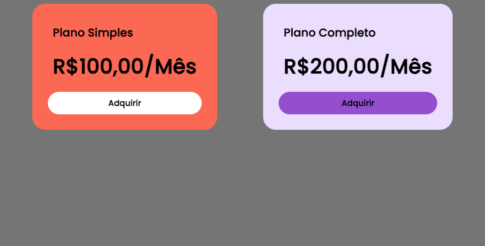

# Template de Cards

Este projeto é um template de cards desenvolvido utilizando Angular 17. Ele fornece uma estrutura básica para criar e gerenciar cards de forma eficiente e estilizada.

## Demonstração



## Começando

Instruções para configurar o projeto localmente.

### Pré-requisitos

- Node.js
- Angular 17

### Instalação

1. Clone o repositório:
   ```bash
   git clone https://github.com/seuusuario/seurepositorio.git
   ```
2. Navegue até o diretório do projeto:
   ```bash
   cd seurepositorio
   ```
3. Instale as dependências:
   ```bash
   npm install
   ```

## Uso

Para iniciar o servidor de desenvolvimento, execute o seguinte comando:

```bash
ng serve
```

Depois, abra o navegador e acesse `http://localhost:4200` para visualizar o template de cards.

## Contribuição

1. Faça um fork do projeto.
2. Crie sua feature branch (`git checkout -b feature/nome-da-sua-feature`).
3. Faça commit das suas alterações (`git commit -m 'Adicionando uma nova feature'`).
4. Faça push para a branch (`git push origin feature/nome-da-sua-feature`).
5. Abra um Pull Request.

## Licença

Este projeto está licenciado sob a Licença MIT - veja o arquivo [LICENSE](LICENSE) para mais detalhes.
